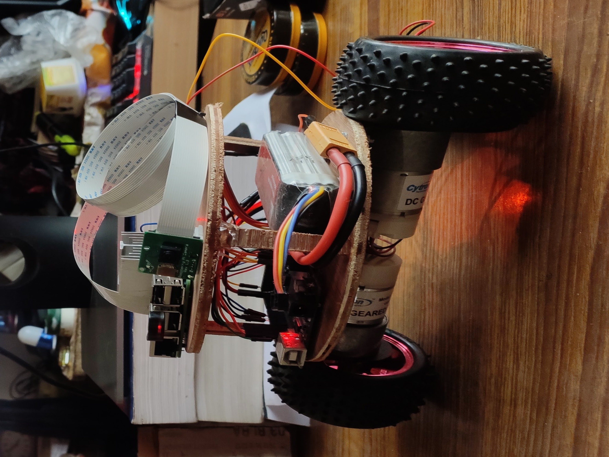
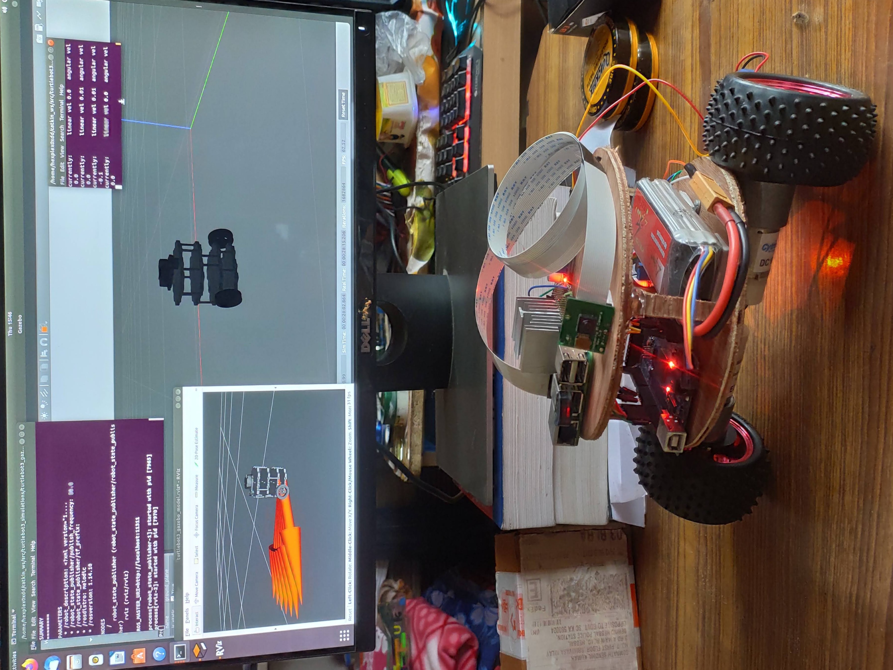

# Pauci-Bot
This is turtlebot on two wheels. I have tried to recreate a full working turtlebot model so that I could use it for testing out many classical and learning based algorithms on it.

## Setup Guide
  Cut the chase and go to <a href="/setup_guide.md">here</a>

## Glimpse

</img>

</img>
These are a few images of the bot

## Features
Soon to come

## Uses
soon to come

## Projects
The following are the projects done over this as a platform.
